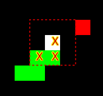

# rl-snake
Some reinforcement learning algorithms to play snake game taken from Sutton's book

## Usage

```$ python snake.py  --help
usage: snake.py [-h] [--train | --no-train] [--visual | --no-visual] [--delay DELAY] [--brick BRICK] [--x X] [--y Y] [--grow | --no-grow] [--debug | --no-debug]

optional arguments:
  -h, --help            show this help message and exit
  --train, --no-train   Train and save Q.pkl in current directory, load it when not `train`.
                        To stop training press `Ctrl-C`. (default: False)
  --visual, --no-visual
  --delay DELAY         controls snake speed in visual mode
  --brick BRICK         size of a grid cell in pixels
  --x X                 frame `x` size in bricks
  --y Y                 frame `y` size in bricks
  --grow, --no-grow     whether to grow snake on eating a target (default: False)
  --debug, --no-debug   move snake by7 hand and see it's state (default: False)
```

## Monte Carlo Control with Exploring starts (epsilon greedy)

### Non-growing snake
```python
python snake.py --train --x=5 --y=5
```

It is enough to train non-growing snake on a 5x5 grid to be able to use it on arbitrary large grid. \
The more you train the better it becomes. Test it:
```python
python snake.py --visual --x=10 --y=10
```


### Growing snake
```python
python snake.py --train --x=5 --y=5 --grow
```

Additional 9 boolean indicators are added to a snake's state for each cell around a head, indicating if cell belongs to a snake. So snake is myopic in terms of what it can see. Adding all grid cells is not tractable due to enourmouse ammount of possible states.



```python
python snake.py --visual --x=5 --y=5 --grow --delay=0.3
```


